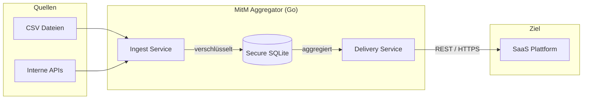

# Man-in-the-Middle (MitM) Daten-Aggregator

Ein sicheres, zuverlässiges und entkoppeltes System zur Aggregation von Daten aus verschiedenen Quellen und deren täglicher Übertragung an eine Ziel-SaaS-Plattform.

## Überblick

Der MitM Aggregator fungiert als "Puffer" im Unternehmensnetzwerk. Er sammelt Daten (z. B. aus CSV-Dateien), speichert diese hochsicher verschlüsselt in einer lokalen Datenbank zwischen und überträgt sie einmal täglich gebündelt per REST-API an eine SaaS-Lösung.

### Kernmerkmale

*   **Sicherheit (PII-Schutz):** Personenbezogene Daten werden mittels **Envelope Encryption** (AES-GCM) geschützt. Jedes Datenfragment erhält einen eigenen Schlüssel (DEK), der wiederum durch einen Master-Key (KEK) geschützt wird.
*   **Resilienz:** Automatische Wiederholungsversuche (Retries) mit Exponential Backoff bei Netzwerkfehlern.
*   **Datenschutz:** Der Master-Key wird niemals auf der Festplatte gespeichert, sondern nur zur Laufzeit im Arbeitsspeicher gehalten.
*   **Transparenz:** Vollständiges Monitoring via Prometheus-Metriken und strukturierte JSON-Logs.

---

## Architektur

Das System folgt dem Adapter-Muster, um flexibel neue Datenquellen (CSV, SQL, APIs) anbinden zu können.



Eine detaillierte Beschreibung finden Sie in der [Systemübersicht](docs/Systemübersicht.md) sowie im [Architekturkonzept](docs/Architektur.md).

---

## Erste Schritte

### Voraussetzungen

*   Go 1.24+
*   SQLite3
*   OpenSSL (zur Generierung des Master-Keys)

### Bauen und Testen

1.  **Abhängigkeiten installieren:**
    ```bash
    go mod tidy
    ```

2.  **Unit Tests ausführen:**
    ```bash
    go test ./...
    ```

3.  **Kompilieren:**
    ```bash
    go build -o bin/mitm-server ./cmd/server
    ```

### Starten

Das System benötigt einen 32-Byte Master-Key (Base64 kodiert) als Umgebungsvariable:

```bash
# Master-Key generieren und Server starten
export MASTER_KEY=$(openssl rand -base64 32)
./bin/mitm-server
```

---

## Betrieb & Monitoring

Der Server stellt auf Port `8080` Endpunkte für den Betrieb bereit:

*   **Metriken:** `http://localhost:8080/metrics` (Prometheus Format)
*   **Liveness:** `http://localhost:8080/healthz`
*   **Readiness:** `http://localhost:8080/readyz`

---

## Lizenz

Dieses Projekt ist unter der **Apache License 2.0** lizenziert. Siehe [LICENSE](LICENSE) und [NOTICE](NOTICE) für Details zu Drittanbieter-Lizenzen.

---
© 2026 ZHENG Robert (robert @hase-zheng.net)
