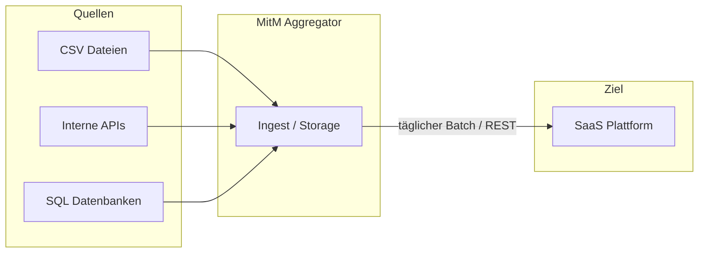
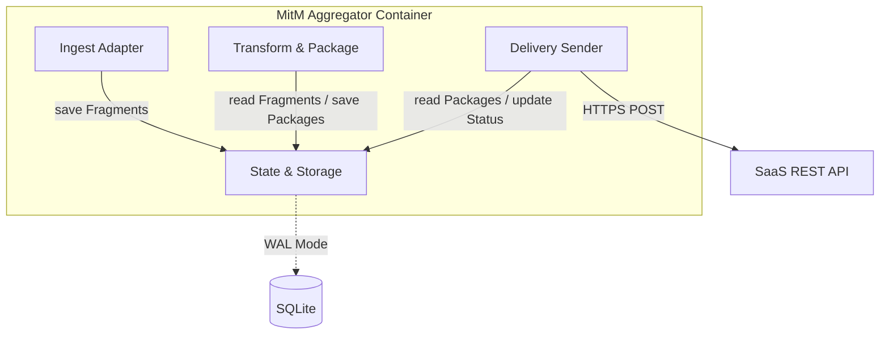
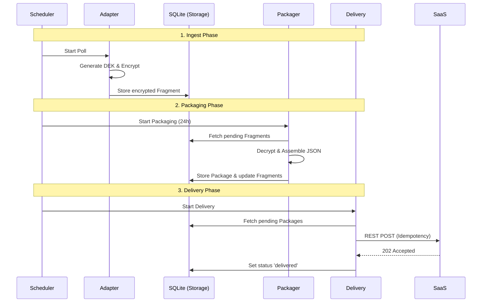
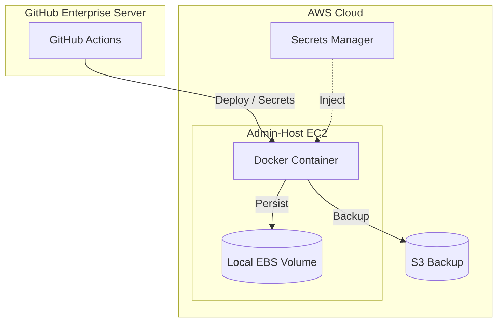
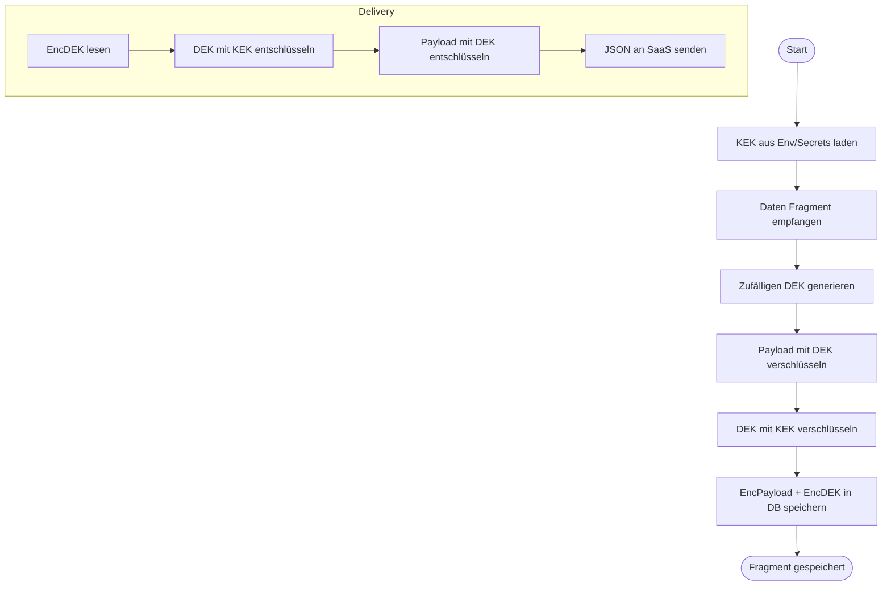

# Architekturkonzept: MitM Daten-Aggregator

## Inhaltsverzeichnis

- [Architekturkonzept: MitM Daten-Aggregator](#architekturkonzept-mitm-daten-aggregator)
  - [Inhaltsverzeichnis](#inhaltsverzeichnis)
- [1. Einführung und Ziele](#1-einführung-und-ziele)
  - [Aufgabenstellung](#aufgabenstellung)
  - [Qualitätsziele](#qualitätsziele)
  - [Stakeholder](#stakeholder)
- [2. Randbedingungen](#2-randbedingungen)
- [3. Kontextabgrenzung](#3-kontextabgrenzung)
  - [Fachlicher Kontext](#fachlicher-kontext)
  - [Technischer Kontext](#technischer-kontext)
- [4. Lösungsstrategie](#4-lösungsstrategie)
- [5. Bausteinsicht](#5-bausteinsicht)
  - [Whitebox Gesamtsystem](#whitebox-gesamtsystem)
    - [Ingest (Poller/Adapter)](#ingest-polleradapter)
    - [State \& Storage](#state--storage)
    - [Transform \& Package](#transform--package)
    - [Delivery (Sender)](#delivery-sender)
- [6. Laufzeitsicht](#6-laufzeitsicht)
  - [Täglicher Workflow](#täglicher-workflow)
- [7. Verteilungssicht](#7-verteilungssicht)
  - [Infrastruktur Ebene 1](#infrastruktur-ebene-1)
- [8. Querschnittliche Konzepte](#8-querschnittliche-konzepte)
  - [Sicherheit \& Key-Management](#sicherheit--key-management)
  - [Überwachung \& Diagnose](#überwachung--diagnose)
- [9. Architekturentscheidungen](#9-architekturentscheidungen)
- [10. Qualitätsanforderungen](#10-qualitätsanforderungen)
- [11. Risiken und technische Schulden](#11-risiken-und-technische-schulden)
- [12. Artefakte](#12-artefakte)
  - [Security Flow Diagram](#security-flow-diagram)
- [13. Glossar](#13-glossar)

# 1. Einführung und Ziele

## Aufgabenstellung

Bereitstellung eines zuverlässigen, sicheren und entkoppelten Systems (Man-in-the-Middle Aggregator), das Daten aus diversen Quellsystemen (links) einsammelt, lokal puffert, täglich zu JSON-Paketen aggregiert und per REST an eine Ziel-SaaS (rechts) überträgt.

**Kernmerkmale:**

- Entkoppelung von Quellen und Ziel.
- Täglich paketierte Übertragung.
- Vollständige Nutzung von Open-Source-Komponenten (MIT, Apache 2.0).
- Sichere Speicherung von personenbezogenen Daten (PII) mittels Envelope Encryption.

## Qualitätsziele

| Ziel                         | Beschreibung                                                                             |
| :--------------------------- | :--------------------------------------------------------------------------------------- |
| **Sicherheit (Datenschutz)** | Schutz von PII-Daten "at-rest" durch AES-GCM Envelope Encryption (KEK/DEK).              |
| **Resilienz**                | Fehlertoleranz gegenüber Ausfällen der SaaS oder Quellsysteme durch Retries und Cursors. |
| **Wartbarkeit**              | Modulares Design (Adapter-Pattern) für einfache Anbindung neuer Quellen.                 |
| **Nachvollziehbarkeit**      | Lückenloses Audit-Logging sicherheitsrelevanter und prozessualer Events.                 |

## Stakeholder

| Rolle                       | Erwartungshaltung                                                                  |
| :-------------------------- | :--------------------------------------------------------------------------------- |
| **IT-Architekt**            | Saubere technologische Trennung, Einhaltung von Sicherheitsstandards.              |
| **Sicherheitsbeauftragter** | Verschlüsselung von PII-Daten, sicheres Key-Handling (MasterKey nicht persistent). |
| **Betriebsteam (Admins)**   | Einfaches Deployment (Container), klares Monitoring (Prometheus), Logging (JSON).  |
| **SaaS-Anbieter**           | Einhaltung von Rate Limits, korrekte JSON-Strukturen, Idempotenz.                  |

# 2. Randbedingungen

- **Technologie:** Go (Golang) als Primärsprache für Performance und Single-Binary Deployment.
- **Datenhaltung:** SQLite (lokal) für State-Management und Fragmente (WAL-Mode).
- **Plattform:** AWS EC2 (Admin-Host) mit Docker, GitHub Enterprise Server (GHES) für CI/CD.
- **Lizenzen:** Nur Open Source (MIT, Apache 2.0, etc.). Keine proprietären Bibliotheken.

# 3. Kontextabgrenzung

## Fachlicher Kontext

Das System steht zwischen beliebig vielen Quellsystemen (z.B. CSV-Exporte, interne APIs) und einer zentralen SaaS-Plattform. Es fungiert als Puffer und Aggregator.

## Technischer Kontext

- **Quell-Schnittstellen:** Adapter-Interface (Polling/Push) für CSV, REST, SQL, Kafka, MFT, ...
- **Ziel-Schnittstellen:** REST API (HTTPS) der SaaS inkl. Bearer-Token und Idempotency-Headers.
- **Key-Management:** Injektion des Master-Keys via Environment (GHES Secrets / AWS Secrets Manager).

# 4. Lösungsstrategie

- **Adapter-Pattern:** Kapselung der Quell-Logik zur einfachen Erweiterbarkeit.
- **Asynchrone Verarbeitung:** Trennung von Ingest (Poll), Processing (Package) und Delivery (Send).
- **Envelope Encryption:** Jedes Fragment wird mit einem individuellen DEK verschlüsselt; DEKs werden mit einem KEK (MasterKey) verschlüsselt gespeichert.
- **Stateful Polling:** Nutzung von Cursors, um nur neue Daten seit dem letzten Lauf zu laden.

# 5. Bausteinsicht

## Whitebox Gesamtsystem

Das System besteht aus vier funktionalen Kern-Bausteinen:

### Ingest (Poller/Adapter)

Verantwortlich für das Abrufen der Daten aus Quellen. Transformiert Rohdaten in normalisierte Fragmente.

### State & Storage

Lokale SQLite-Datenbank. Verwaltet Cursors (Fortschritt), Fragmente (Puffer) und Packages (Versandbereit).

### Transform & Package

Aggregiert alle `pending` Fragmente eines Tages in ein oder mehrere JSON-Packages entsprechend der SaaS-Spezifikation.

### Delivery (Sender)

Überträgt die Packages an die SaaS. Implementiert Retry-Logik, Exponential Backoff und Verschiebung in die Dead-Letter-Queue (DLQ).

# 6. Laufzeitsicht

## Täglicher Workflow

# 7. Verteilungssicht

## Infrastruktur Ebene 1

# 8. Querschnittliche Konzepte

## Sicherheit & Key-Management

- **Envelope Encryption:** KEK (MasterKey) liegt nur im RAM. DEKs liegen verschlüsselt in der DB.
- **TLS:** HTTPS für alle externen Aufrufe.
- **Least Privilege:** Container läuft als non-root User mit eingeschränkten Filesystem-Rechten.

## Überwachung & Diagnose

- **Logging:** Strukturiertes JSON-Logging via `zerolog` (stdout für Docker-Log-Treiber).
- **Metriken:** Prometheus Exporter für Fragment-Zähler, Paket-Größen und API-Latenzen.
- **Audit-Log:** Unveränderbare Tabelle in SQLite für kritische Aktionen (Admin-Zugriff, Key-Rotation).

# 9. Architekturentscheidungen

- **SQLite statt Postgres:** Minimierung des Infrastruktur-Overheads auf dem Admin-Host. Resilienz durch WAL-Mode.
- **Go statt Python:** Typsicherheit bei komplexen Transformationen und einfache Verteilung als statisches Binary.
- **Stateless App / Stateful Storage:** Die App selbst kann jederzeit neu gestartet werden; der gesamte Zustand liegt in der SQLite-Datei.

# 10. Qualitätsanforderungen

- **PII-Schutz:** 100% der personenbezogenen Daten müssen verschlüsselt persistiert werden.
- **Datenverlust-Prävention:** Cursors verhindern doppeltes Einlesen oder Überspringen von Datensätzen.

# 11. Risiken und technische Schulden

- **SQLite Dateigröße:** Bei extrem hohem Volumen muss eine Archivierungsstrategie für alte Fragmente implementiert werden.
- **Key Loss:** Verlust des Master-Keys führt zu totalem Datenverlust in der lokalen DB (Lösung: Backup des Keys im Vault).

# 12. Artefakte

## Security Flow Diagram

# 13. Glossar

| Begriff      | Definition                                                                  |
| :----------- | :-------------------------------------------------------------------------- |
| **Fragment** | Kleinste Dateneinheit aus einer Quelle (z.B. eine Zeile einer CSV).         |
| **Package**  | Aggregation mehrerer Fragmente zu einem JSON-Dokument für den SaaS-Versand. |
| **KEK**      | Key Encryption Key (Master Key).                                            |
| **DEK**      | Data Encryption Key (pro Fragment).                                         |
| **DLQ**      | Dead Letter Queue (Ablage für dauerhaft fehlgeschlagene Datensätze).        |
