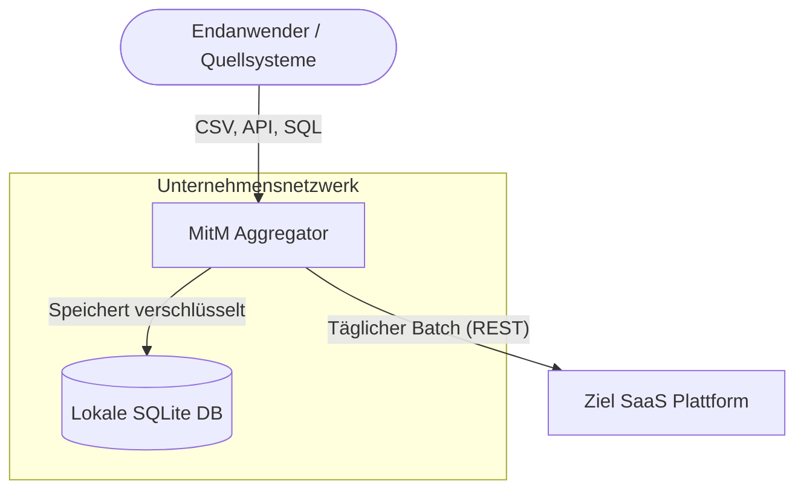
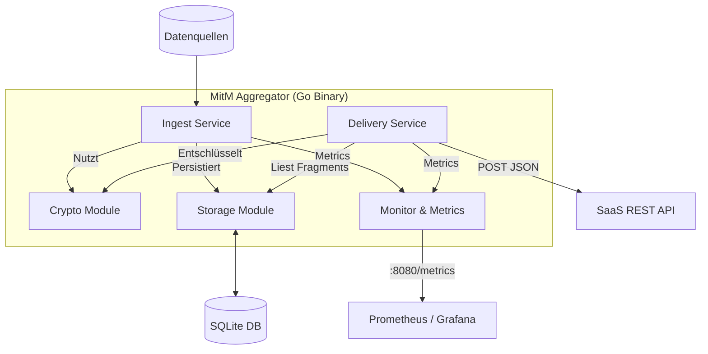
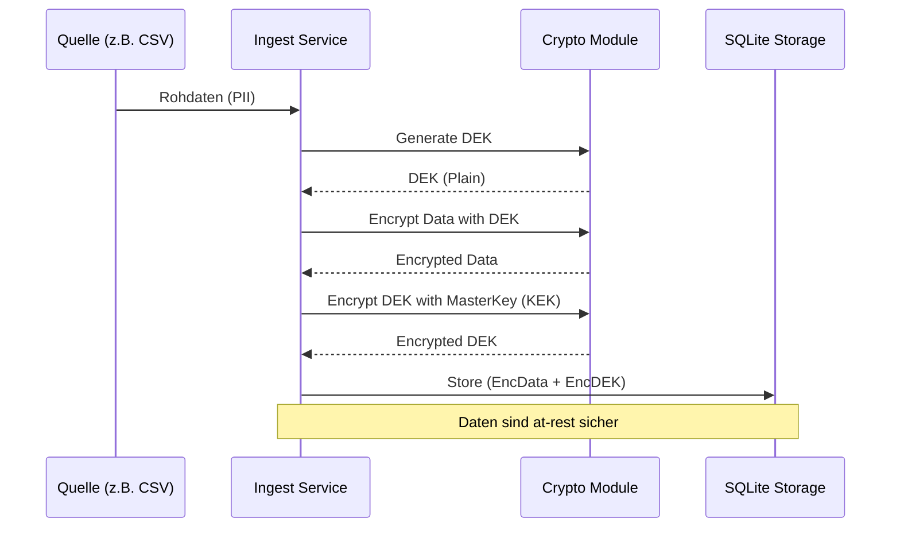
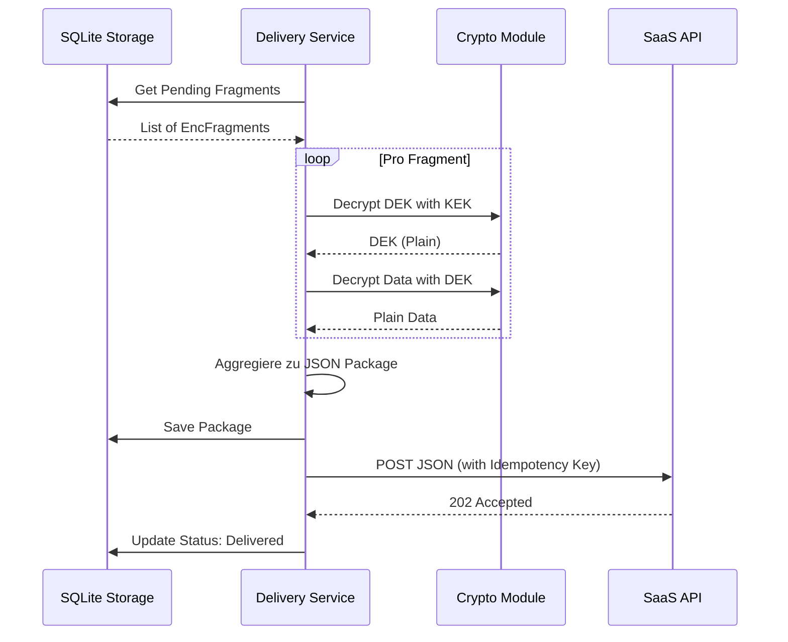

# Systemübersicht: MitM Aggregator

Dieses Dokument bietet einen Überblick über das Systemdesign und den Datenfluss des Man-in-the-Middle (MitM) Aggregators.

## 1. Systemkontext (C4 Model - Level 1)

Der Aggregator fungiert als sichere Zwischenschicht zwischen verschiedenen Datenquellen und einer Ziel-SaaS-Plattform.

## 2. Container-Ansicht (C4 Model - Level 2)

Detailliertere Ansicht der internen Komponenten der Go-Applikation.

## 3. Datenfluss: Ingest & Encryption

Der Prozess der Datenaufnahme und der **Envelope Encryption**.

## 4. Datenfluss: Packaging & Delivery

Der tägliche Prozess der Aggregation und Übertragung.

## 5. Monitoring & Betrieb

- **Health Checks:**
  - `/healthz`: Liveness Probe (App läuft).
  - `/readyz`: Readiness Probe (DB-Verbindung steht).
- **Metriken:**
  - `mitm_fragments_ingested_total`: Anzahl aufgenommener Datensätze.
  - `mitm_packages_delivered_total`: Erfolgreiche Übertragungen.
  - `mitm_delivery_failures_total`: Fehlgeschlagene Übertragungen (Retries/DLQ).
