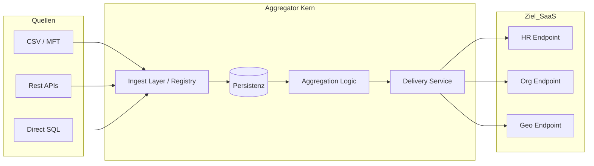

# Architektur: MitM Daten-Aggregator

Dieses Dokument beschreibt die technische Architektur des MitM Daten-Aggregators. Es umfasst die technologische Auswahlmatrix für Sprachen und Persistenz, die Bausteinsicht des Systems sowie die detaillierte Sicherheitsarchitektur zur Verarbeitung sensibler Daten.

---

## Dokumenten-Lenkung

| **VERSION** | 0.2.0 |
| :--- | :--- | 
| **DATE**    | 2026-05-04 |
| **STATUS**  | ***Vorlage*** |
| **AUTHOR**  | ZHENG Robert, FG-514 |
| **FILE**    | architektur.md |

**Änderungshistorie:**
| Version | Datum | Autor | Änderungen | Status | Approver |
| :--- | :--- | :--- | :--- | :--- | :--- |
| 0.1.0 | 20.04.2026 | ZHENG Robert | Initiale Erstellung | Draft | -/- |
| 0.2.0 | 04.05.2026 | ZHENG Robert | Konsolidierung und Optimierung der Architektur | Vorlage | -/- |

---

## Inhaltsverzeichnis
- [1. Einführung und Ziele](#1-einführung-und-ziele)
  -  [Applikation Cority Data-Feed](#cority-data-feed) 
  -  [ System MitM](#system-mitm)
  -  [Qualitätsziele](#qualitätsziele)
  -  [Stakeholder](#stakeholder)
- [2. Technologische Auswahlmatrix](#2-technologische-auswahlmatrix)
  - [2.1 Programmiersprachen & CI/CD (GitHub zu AWS ECR)](#21-programmiersprachen--cicd-github-zu-aws-ecr)
  - [2.2 Daten-Persistenz](#22-daten-persistenz)
- [3. Bausteinsicht & Erweiterbarkeit](#3-bausteinsicht--erweiterbarkeit)
  - [3.1 Multi-Adapter & Multi-Target Architektur](#31-multi-adapter--multi-target-architektur)
  - [3.2 Schnittstellen-Design](#32-schnittstellen-design)
- [4. Querschnittliche Konzepte](#4-querschnittliche-konzepte)
  - [4.1 Sicherheit & Datenschutz (Security by Design)](#41-sicherheit--datenschutz-security-by-design)
  - [4.2 Aggregation & Paketierung](#42-aggregation--paketierung)
- [5. Architekturentscheidungen (ADR)](#5-architekturentscheidungen-adr)

---

## 1. Einführung und Ziele

### Applikation Cority Data-Feed
Das Cority Data-Feed Systems ist die Bereitstellung von HR-Master-, Organisations- und Satndort-Daten für die Cority Health & Safety Suite Global App (APP-44332) für die Märkte DE/AT/ZA/HU/MX/UK.
 
### System MitM
Der **MitM (Man-in-the-Middle) Daten-Aggregator** dient als entkoppelndes Bindeglied zwischen verschiedenen Quellsystemen und einer zentralen Ziel-SaaS-Plattform. Er sammelt Daten (z. B. HR, Org, Geo), puffert diese sicher und überträgt sie täglich in optimierten Paketen.

### Qualitätsziele
*   **Sicherheit:** Schutz personenbezogener Daten (PII) durch Envelope Encryption.
*   **Flexibilität:** Modularer Aufbau (Adapter-Pattern) für neue Quell- und Ziel-Schnittstellen.
*   **Resilienz:** Robuste Verarbeitung trotz Ausfällen von Drittsystemen.
*  **Wartbarkeit:** Einsatz moderner Technologie/Plattform.
*  **Nachvollziehbarkeit:** Lückenloses Audit-Logging sicherheitsrelevanter und prozessuraler Events.

### Stakeholder

| Rolle                   | Person                                              | Erwartungshaltung                                                  |
| :---------------------- | :-------------------------------------------------- | :----------------------------------------------------------------- |
| (ET) Architektur        | in Klärung, FG-5-I                                  | Entsprechung der IT-Strategie.                                     |
| Sicherheitsbeauftragter | FG-15*, ???                                         | Einhaltung von Sicherheitsstandards. Verschlüsselung von PII-Daten |
| Produktverantwortlicher | Christian Schneider, FG-51; Dennis Beckmann, FG-514 | Einfache Wartung & Deployment                                      |

---

## 2. Technologische Auswahlmatrix

> in Klärung: Einsatz/Verwendung von APIM/APIGEE 

### 2.1 Programmiersprachen & CI/CD (GitHub zu AWS ECR)

Für die Implementierung wird eine typsichere Sprache vorausgesetzt. Python bleibt das Werkzeug für Prototyping.

| Kriterium             | Go                                                          | C++                                                        | Java                           |
| :-------------------- | :---------------------------------------------------------- | :--------------------------------------------------------- | :----------------------------- |
| **Artifact Delivery** | Single Binary (sehr klein). HTTP inkludiert. Ideal für ECR. | Binary + Libs.  HTTP inkludiert. Komplexeres Docker-Image. | Fat-JAR/-War. HTTP mit Payara. |
| **CI/CD Build-Zeit**  | Sehr schnell (nativ).                                       | Langsam (Kompilierung/Linken).                             | Mittel (Gradle/Maven).         |
| **Speicherverbrauch** | Minimal.                                                    | Extrem gering (manuelle Kontrolle).                        | Hoch (JVM Overhead).           |
| **Eignung für ECR**   | Exzellent (kleine Images, schneller Pull).                  | Gut (wenn statisch gelinkt).                               | Mittel (große Basis-Images).   |
| **Typsicherheit**     | Statisch, modern.                                           | Statisch, komplex.                                         | Statisch, streng.              |

### 2.2 Daten-Persistenz

Das System benötigt einen lokalen Puffer für Fragmente und Status-Management.

| Technologie          | Pro                                                               | Kontra                                                                                            |
| :------------------- | :---------------------------------------------------------------- | :------------------------------------------------------------------------------------------------ |
| **Datei-basiert**    | Simpelste Form, keine DB-Abhängigkeit.                            | Schwer abfragbar (State-Management komplex). Persistenz nur während Laufzeit (oder EFS/S3).       |
| **SQLite**           | Datei-basiert (Single File), SQL-Power, WAL-Mode für Concurrency. | Begrenzt bei extremem Schreibvolumen (>100k IOPS). Persistenz nur während Laufzeit (oder EFS/S3). |
| **PostgreSQL**       | Volle Performance, Multi-User, Enterprise-Features.               | Erfordert separate Infrastruktur (RDS).                                                           |
| **Mix (Datei + DB)** | Große Blobs im Filesystem, Metadaten/Status in DB.                | Erhöhte Komplexität bei Backups/Konsistenz.                                                       |

---

## 3. Bausteinsicht & Erweiterbarkeit

Um zukünftige Anforderungen (HR, Org, Geo-Daten) abzubilden, wird ein **multi-endpoint-fähiges Design** genutzt.

### 3.1 Multi-Adapter & Multi-Target Architektur

### 3.2 Schnittstellen-Design
*   **Adapter-Registry:** Neue Quell-Schnittstellen (HR-Feed, Geo-Service) werden als Module registriert.
*   **Target-Routing:** Der Delivery-Service erkennt anhand des Paket-Typs den korrekten Ziel-Endpoint und das zugehörige Schema.

---

## 4. Querschnittliche Konzepte

### 4.1 Sicherheit & Datenschutz (Security by Design)

Das Sicherheitssystem basiert auf mehreren Verteidigungsschichten, um die Vertraulichkeit und Integrität der Daten zu gewährleisten.

#### 4.1.1 Envelope Encryption (KEK/DEK)
Um personenbezogene Daten (PII) "at-rest" zu schützen, wird das Envelope-Encryption-Verfahren angewendet:
*   **Data Encryption Key (DEK):** Für jedes Daten-Fragment wird ein symmetrischer Schlüssel (AES-256-GCM) generiert. Dieser verschlüsselt den eigentlichen Inhalt.
*   **Key Encryption Key (KEK / Master Key):** Der DEK wird mit dem KEK verschlüsselt, bevor er in der Datenbank gespeichert wird. Der KEK wird niemals persistent auf dem gleichen System wie die Daten gespeichert (Injektion via RAM/Secrets Manager).
*   **Vorteil:** Bei einem Kompromiss der Datenbank sind die Daten ohne den externen KEK wertlos. Zudem ermöglicht dies eine effiziente Key-Rotation.

#### 4.1.2 Transportverschlüsselung (TLS)
*   Sämtliche Kommunikation nach außen (Quell-APIs, Ziel-SaaS, AWS-Services) erfolgt zwingend über **TLS 1.2 oder höher**.
*   Zertifikatsvalidierung ist obligatorisch, um Man-in-the-Middle-Angriffe auf den Aggregator selbst zu verhindern.

#### 4.1.3 Unveränderbares Audit-Log
*   Sicherheitsrelevante Ereignisse (z. B. Key-Zugriffe, fehlgeschlagene Logins, Systemstarts, Konfigurationsänderungen) werden in einer separaten **Audit-Tabelle** protokolliert.
*   Dieses Log ist als "Append-Only" konzipiert und dient der forensischen Nachvollziehbarkeit im Falle eines Sicherheitsvorfalls.

### 4.2 Aggregation & Paketierung
Fragmente werden nicht blind gesammelt, sondern nach **Typ (HR/Geo/...)** und **Zeitfenster** gruppiert. Dies erlaubt unterschiedliche Übertragungszyklen pro Datentyp.

---

## 5. Architekturentscheidungen (ADR)

| ADR 01           | Typsicherheit                                                                                                          |
| :--------------- | :--------------------------------------------------------------------------------------------------------------------- |
| **Datum**        | 04.05.2026                                                                                                             |
| **Status**       | offen                                                                                                                  |
| **Kontext**      | Typsicherheit ist verpflichtend für den Core-Aggregator zur Vermeidung von Laufzeitfehlern bei Daten-Transformationen. |
| **Teilnehmer**   |                                                                                                                        |
| **Entscheidung** |                                                                                                                        |
| **Konsequenzen** |                                                                                                                        |

| ADR 02           | Neutraler Ingest                                                                               |
| :--------------- | :--------------------------------------------------------------------------------------------- |
| **Datum**        | 04.05.2026                                                                                     |
| **Status**       | offen                                                                                          |
| **Kontext**      | Die Ingest-Schnittstelle muss zustandslos (stateless) sein und Cursor-Management unterstützen. |
| **Teilnehmer**   |                                                                                                |
| **Entscheidung** |                                                                                                |
| **Konsequenzen** |                                                                                                |

| ADR 03           | Persistenz-Layer                                                                                                                             |
| :--------------- | :------------------------------------------------------------------------------------------------------------------------------------------- |
| **Datum**        | 04.05.2026                                                                                                                                   |
| **Status**       | offen                                                                                                                                        |
| **Kontext**      | Abstraktion der DB-Zugriffe, um einen Wechsel zwischen SQLite und PostgreSQL ohne Code-Änderung im Core zu ermöglichen (Repository-Pattern). |
| **Teilnehmer**   |                                                                                                                                              |
| **Entscheidung** |                                                                                                                                              |
| **Konsequenzen** |                                                                                                                                              |

| ADR 04           | Persistenz: Technologie                           |
| :--------------- | :------------------------------------------------ |
| **Datum**        | 04.05.2026                                        |
| **Status**       | offen                                             |
| **Kontext**      | Umgang mit Blobs und Daten-Artifakten, Metadaten. |
| **Teilnehmer**   |                                                   |
| **Entscheidung** |                                                   |
| **Konsequenzen** |                                                   |
