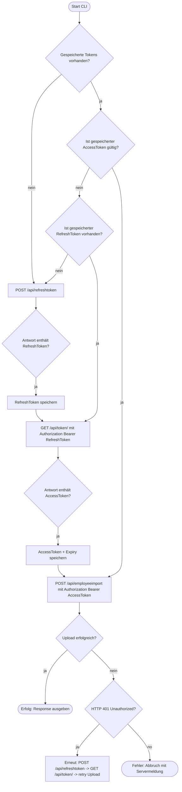

# uploader.py

test-script um die saas (demo) API mit Testdaten anzusprechen

## Übersicht

Dieses Repository enthält ein Python‑CLI‑Tool (uploader.py) zum Hochladen von Mitarbeiterdaten an die saas‑Demo‑API. Der Ablauf ist zweistufig authentifiziert:

1. Refresh Token per POST /api/refreshtoken (Credentials).

2. Access Token per GET /api/token/ mit Authorization: Bearer <RefreshToken>.

3. Upload per POST /api/employeeimport mit Authorization: Bearer <AccessToken> und JSON‑Payload (data.json).

Das Script verwaltet Token lokal, prüft Ablaufzeiten und versucht bei Bedarf eine erneute Authentifizierung.

## Authentifizierung

### Kurzüberblick des Prozesses

1. Refresh Token: Das Script sendet die Credentials per POST /api/refreshtoken. Die API liefert ein RefreshToken im Feld Token und optional ExpiryDateTime.

2. Access Token: Mit GET /api/token/ und Header Authorization: Bearer <RefreshToken> wird ein AccessToken (Feld AccessToken) angefordert. Die Antwort kann AccessTokenExpiryDateTime enthalten.

3. Upload: Der Upload erfolgt per POST /api/employeeimport mit Header Authorization: Bearer <AccessToken> und dem JSON‑Body aus data.json.

**Token‑Management**: uploader.py speichert AccessToken (und optional RefreshToken + Expiry) lokal (Standard: ~/.config/saas_cli/token.json) und prüft vor jedem Upload die Gültigkeit. Bei abgelaufenem AccessToken wird automatisch Refresh → Access ausgeführt. Bei 401 Unauthorized versucht das Script eine einmalige Reauth und wiederholt den Upload.

## Ablaufdiagramm



## Voraussetzungen und Installation

### Systemanforderungen

- Linux (oder WSL)
- Python 3.8+
- Netzwerkzugang zur API https://mycompanygroup.demo.saas.com

### Abhängigkeiten

```bash
python -m pip install --user requests
```

#### Dateien

- uploader.py — das CLI‑Script (siehe Beschreibung unten)
- data.json — JSON‑Payload für /api/employeeimport (Beispiel weiter unten)
- Token‑Speicher: standardmäßig ~/.config/saas_cli/token.json

## Repository vorbereiten

```bash
uploader.py ausführbar machen:
chmod +x uploader.py
```

## Bedienung und Beispiele

Aufruf

```bash
./uploader.py --base-url https://mycompanygroup.demo.saas.com \
  --login saas_Integration --password 'saas123$' \
  --upload-file data.json
```

### Optionen

- --base-url Basis‑URL der API (ohne abschließenden Slash empfohlen).
- --login Loginname für /api/refreshtoken.
- --password Passwort für /api/refreshtoken.
- --upload-file Pfad zur JSON‑Datei mit options und records.
- --token-file optionaler Pfad zur Token‑Datei (Standard: ~/.config/saas_cli/token.json).
- --force-auth erzwingt erneute Authentifizierung, auch wenn ein gültiger Token vorhanden ist.
- --verbose aktiviert ausführliches Logging.

### Exit‑Codes

- 0 — Erfolg
- 2 — Authentifizierung fehlgeschlagen
- 3 — Access‑Token Beschaffung fehlgeschlagen
- 4 — Upload‑Datei nicht gefunden
- 5 — Upload‑Datei nicht lesbar
- 6 — Upload HTTP Fehler (z. B. 400)
- 7 — Sonstiger Upload‑Fehler

## Beispielausgabe

- Bei Erfolg: JSON‑Response der API wird auf STDOUT formatiert ausgegeben.
- Bei Fehlern: Exit‑Code ungleich 0 und aussagekräftige Logzeilen.

## Beispiel data.json (aus Postman)

> [!WARNING]
> Scheinbar nutzt die saas-API keinen JSON-Validator

**Hinweis**: Entferne alle JSON‑Kommentare und achte auf korrekte Datentypen (Booleans vs Strings). Zwei Varianten:

### Empfohlen (Booleans)

```json
{
  "options": {
    "updateExistingRecords": true,
    "insertBaseTables": true,
    "forceLookupTableUpdate": true,
    "disableSegUpdate": false,
    "autoCreatePortalUser": true,
    "mergeRecordsWithMatchingSsn": false,
    "dateFormat": "mm/dd/yyyy"
  },
  "records": [
    {
      "EmployeeNumber": 537732,
      "SSNValue": 20012974,
      "FirstName": "Joseph Maurie Leopoldt LongLongFirstName",
      "LastName": "Abbott-LongLongLastName",
      "DateOfBirth": "7/31/1954",
      "HomeStreet1": "12 Silver Avenue",
      "HomeCity": "Pretoria",
      "HomeZip": 2001,
      "HomeCountry": "ZA",
      "Organization.Code": "C1",
      "Department.Code": 21158973,
      "Supervisor": 584336,
      "Email": "no_mail_available",
      "LoginID": ""
    }
  ]
}
```

#### Minimaler Testpayload

```json
{
  "options": {
    "updateExistingRecords": true,
    "dateFormat": "mm/dd/yyyy"
  },
  "records": [
    {
      "EmployeeNumber": 1000001,
      "FirstName": "Test",
      "LastName": "User",
      "DateOfBirth": "01/01/1990",
      "Organization.Code": "C1"
    }
  ]
}
```

## Token Handling und Speicher

- Refresh Token: Ergebnis von POST /api/refreshtoken enthält Token (RefreshToken) und optional ExpiryDateTime.
- Access Token: GET /api/token/ mit Authorization: Bearer <RefreshToken> liefert AccessToken und AccessTokenExpiryDateTime.
- Speicherung: uploader.py speichert AccessToken (und optional RefreshToken + Expiry) in ~/.config/saas_cli/token.json mit eingeschränkten Rechten (chmod 600).
- Gültigkeitsprüfung: Vor jedem Upload prüft das Script, ob der gespeicherte AccessToken noch gültig ist (mit 60‑Sekunden Sicherheitsmarge). Ist er abgelaufen, wird automatisch Refresh → Access ausgeführt.
- Fehlerfall 401: Bei 401 Unauthorized versucht das Script einmal eine erneute Authentifizierung und wiederholt den Upload.

## Fehlerbehebung und Debugging

### 400 Bad Request

- Prüfe data.json auf:
  - gültiges JSON (jq . data.json oder python -m json.tool data.json)
  - keine // oder /\* \*/ Kommentare
  - korrekte Datentypen (z. B. true statt "true")
  - Datumformat passend zu options.dateFormat (mm/dd/yyyy)

- Test mit curl:

```bash
curl -v -X POST "https://mycompanygroup.demo.saas.com/api/employeeimport" \
  -H "Authorization: Bearer <ACCESS_TOKEN>" \
  -H "Content-Type: application/json" --data-binary @data.json
```

- Nutze curl --trace-ascii /tmp/curl.trace -v ... um Roh‑Request zu inspizieren.

## Logging

- Starte das Script mit --verbose für detaillierte Logs (Headers, Body‑Preview).
- Das Script schreibt bei Debugging den Request‑Body als Preview in die Logs; bei Bedarf kannst du die Ausgabe in /tmp/last_request_body.json prüfen (siehe Script‑Logging).

## Support

Wenn die API eine Referenz‑ID in der Fehlermeldung zurückgibt (z. B. Reference: ...), leite diese an den saas‑Administrator weiter — sie hilft beim Auffinden des Server‑Logs.

## Sicherheitshinweise

- Speichere Credentials nicht im Klartext in Repositories.
- Token‑Datei hat eingeschränkte Dateirechte (600).
- TLS wird standardmäßig validiert; bei internen Zertifikaten requests mit session.verify anpassen.
