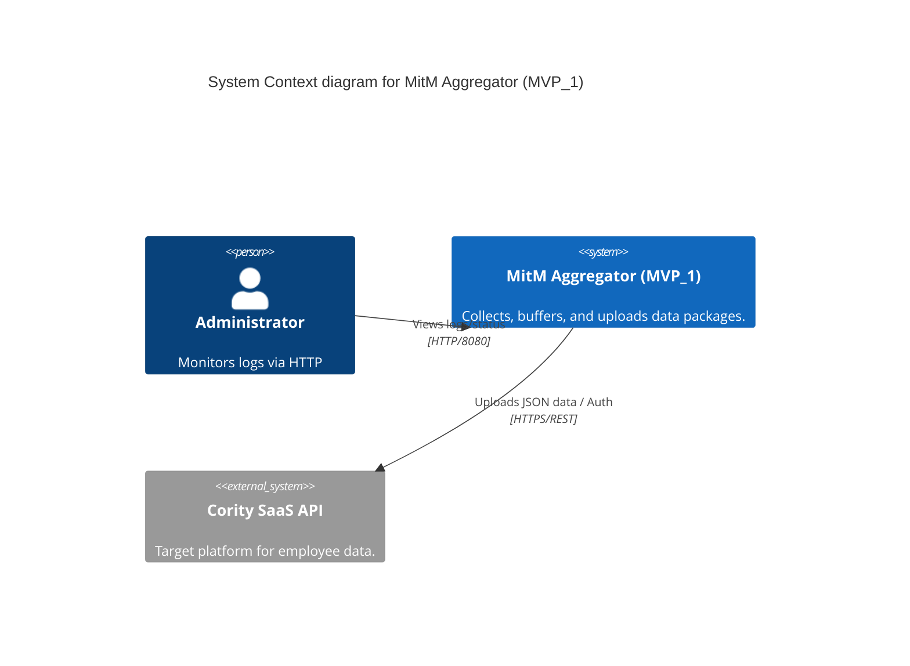
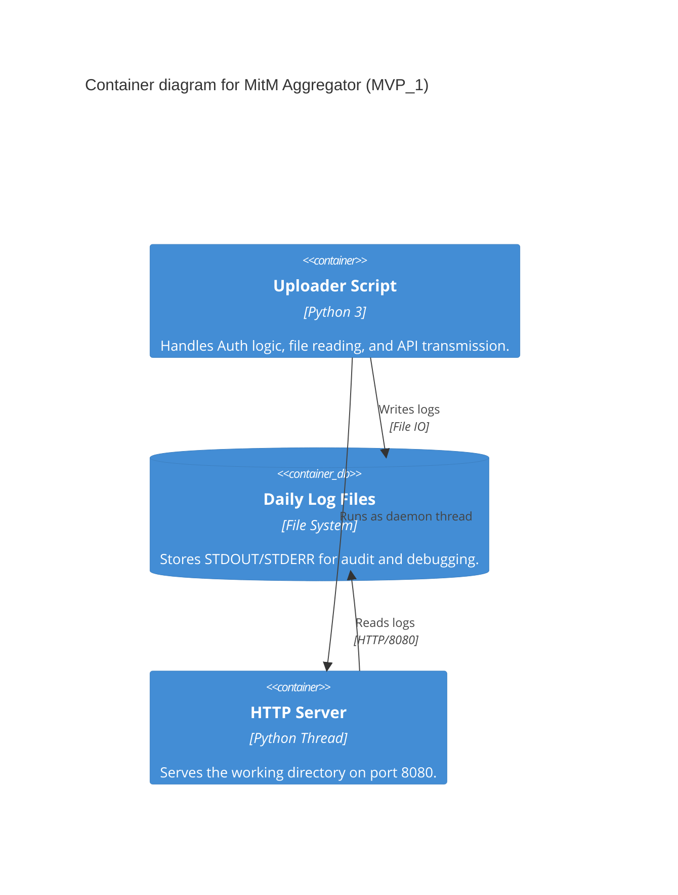

# MVP_1: Enhanced Python Uploader & Aggregator Prototype

This directory contains the first iteration (MVP_1) of the Python-based uploader prototype. It simulates the delivery behavior of the final Go-based aggregator, including authentication flows, data upload, logging, and a local monitoring interface.

## Key Features

- **OAuth2-like Flow:** Implements the `RefreshToken` -> `AccessToken` handshake.
- **Data Upload:** Transmits JSON payloads (e.g., `data.json`) to the Cority `employeeimport` API.
- **Logging Redirection:** Automatically redirects `STDOUT` and `STDERR` to a daily log file (`YYYY-MM-DD.log`).
- **Integrated HTTP Server:** Starts a `SimpleHTTPServer` on port **8080** to serve the current directory (ideal for remote log inspection).
- **Container Ready:** Includes Dockerfiles for both UBI 9 Minimal and Ubuntu.

## Components

- `uploader.py`: The main Python script.
- `.env`: Configuration file for API credentials and URLs.
- `data.json`: Sample payload for the upload.
- `DOCKERFILE_ubi9-minimal`: Hardened production-ready container definition.
- `DOCKERFILE_ubuntu`: General-purpose container definition.

## Architecture (C4 Model)

### Level 1: System Context
The Aggregator (Python Prototype) sits between the local data source and the target SaaS platform.



### Level 2: Container Diagram
Inside the MVP_1 prototype.



## Setup & Usage

### 1. Configuration
Edit the `.env` file to match your environment:
```env
CORITY_BASE_URL=https://your-instance.cority.com
CORITY_LOGIN=your_username
CORITY_PASSWORD=your_password
CORITY_UPLOAD_FILE=data.json
```

### 2. Local Execution
Ensure you have the `requests` library installed:
```bash
pip install requests
python uploader.py
```

### 3. Docker Execution
Build and run using the UBI 9 Minimal image:
```bash
docker build -t mitm-uploader:mvp1 -f DOCKERFILE_ubi9-minimal .
docker run -p 8080:8080 mitm-uploader:mvp1
```

## Monitoring
Once started, you can access the log files through your browser:
- URL: `http://localhost:8080`
- Look for: `YYYY-MM-DD.log`
