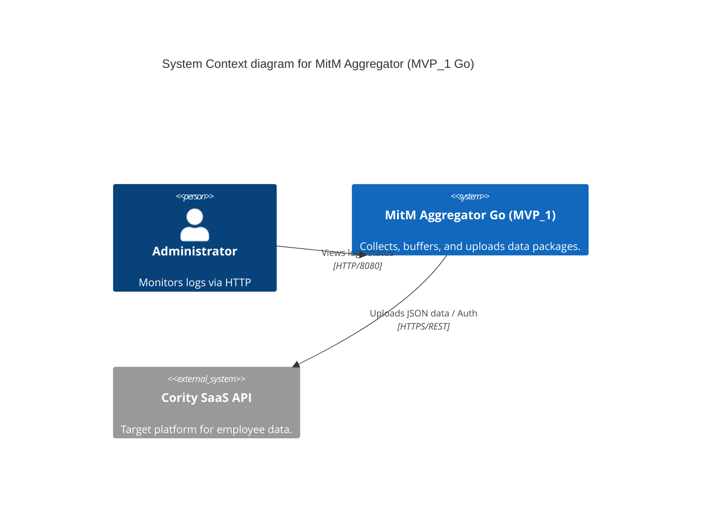
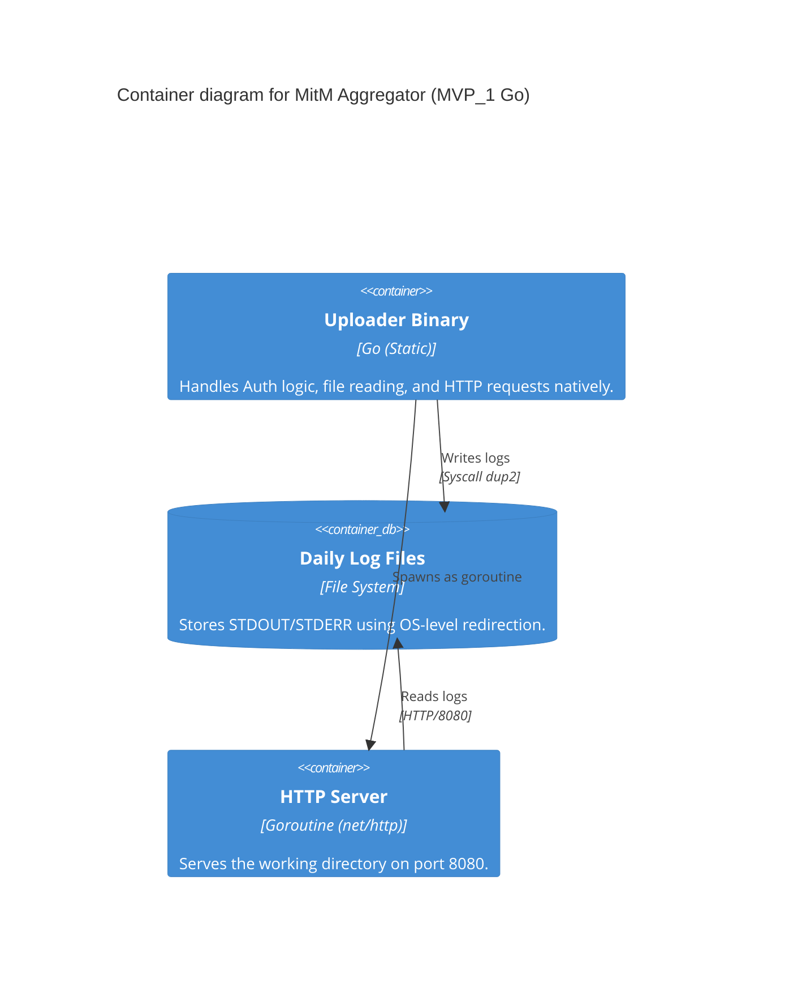

# MVP_1_Go: Go-based Uploader & Aggregator Prototype

This directory contains the Go port of the MVP_1 Python prototype (`mvp_1_go`). It provides identical functionality to the Python version but leverages Go's concurrency, statically compiled binaries, and built-in HTTP server capabilities to align closer with the project's target architecture.

## Key Features

- **Go Implementation:** Single, statically compiled binary (`uploader-go`).
- **OAuth2-like Flow:** Automates the `RefreshToken` -> `AccessToken` authorization.
- **Data Upload:** Transmits JSON payloads (`data.json`) to the Cority `employeeimport` API.
- **Environment Configuration:** Includes a custom `.env` parser to configure without external dependencies.
- **Logging Redirection:** Uses `syscall.Dup2` to securely redirect process STDOUT and STDERR to a daily log file (`YYYY-MM-DD.log`).
- **Integrated HTTP Server:** Runs `http.FileServer` on port **8080** natively via a goroutine to serve logs remotely.
- **Multi-stage Docker Builds:** Creates tiny, secure containers using both UBI 9 Minimal and Ubuntu.

## Components

- `main.go`: The core Go application.
- `go.mod`: Go module definition.
- `.env`: Environment configuration file.
- `data.json`: Sample payload.
- `Dockerfile.ubi9-minimal`: Multi-stage build for a hardened UBI 9 minimal image.
- `Dockerfile.ubuntu`: Multi-stage build for an Ubuntu image.

## Architecture (C4 Model)

### Level 1: System Context



### Level 2: Container Diagram



## Setup & Usage

### 1. Configuration
Edit `.env` to match your credentials:
```env
CORITY_BASE_URL=https://your-instance.cority.com
CORITY_LOGIN=your_username
CORITY_PASSWORD=your_password
CORITY_UPLOAD_FILE=data.json
```

### 2. Local Execution
You can run it directly using the Go toolchain:
```bash
go run main.go
```
Or build a binary:
```bash
go build -o uploader-go main.go
./uploader-go
```

### 3. Docker Execution
Build and run using the UBI 9 Minimal image (Multi-stage build handles Go compilation):
```bash
docker build -t mitm-uploader-go:mvp1 -f Dockerfile.ubi9-minimal .
docker run -p 8080:8080 mitm-uploader-go:mvp1
```

## Monitoring
Since the application runs a lightweight HTTP server on port 8080, open your browser:
- URL: `http://localhost:8080`
- You will see the directory listing. Click on the `.log` files to view real-time standard output and errors.
